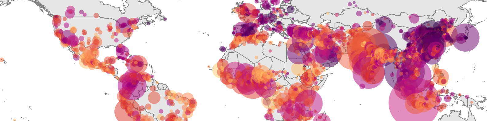

# Hello! 👋

I'm Andy Zimmer, a geospatial scientist currently based at Oak Ridge National Laboratory.
Before ORNL, I was a research scientist at Montana State University, where much of my work focused on population geography, urban change, food systems, and geospatial data science.

Please reach out if you're interested in research ideas or collaboration!

🌐 [ORNL Profile](https://www.ornl.gov/staff-profile/andrew-zimmer)  
📚 [Google Scholar](https://scholar.google.com/citations?user=1-Xk5zMAAAAJ&hl=en)  
✉️ [Email](mailto:zimmera@ornl.gov)

  

